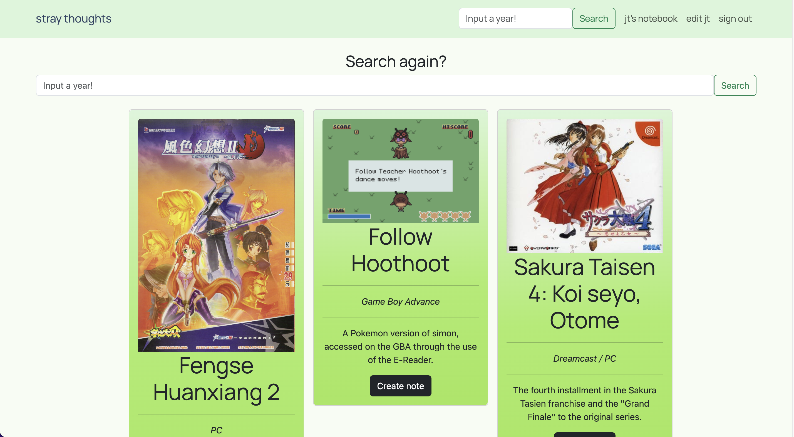
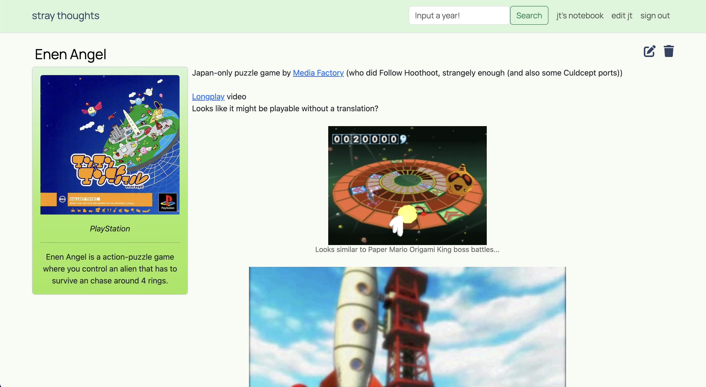
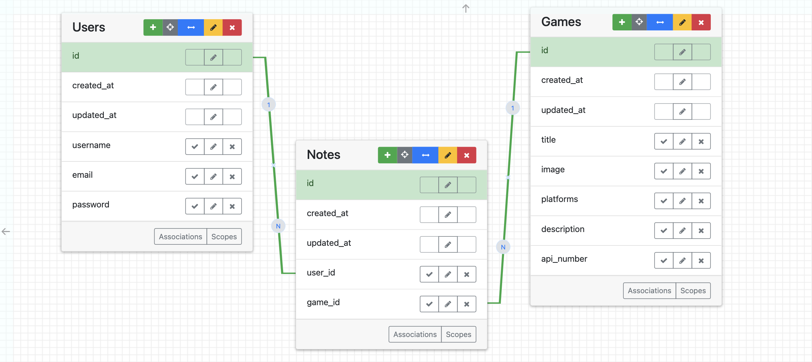

# Stray Thoughts

Stray Thoughts is a platformed designed to assist users Discover and Catalogue games in a single tab. Searching (utilizing Giant Bomb's API) via a given year produces three games at random, which users can then create Notes on. Notes will contain the data displayed via the API search, in addition to a Trix-Content form that can contain text, links, and images.


## Technologies Used
- Ruby version: `3.2.1`
- Rails version: `7.1.3.3`
- Bootstrap 5

## Functionality

### Searh

Once a user has created an account and signed in, they can search for games using the search bar at the top of the page. On mobile, they will need to use the Navigation dropdown to go to the search page manually. From there, searching is as easy as inputting a year and seeing what pops up!


### Notes

When a user finds a game they're interested in, they can create a Note. Notes will contain all the information given by the API search, in addition to having a Trix-Content form that users can fill out with text, links, and images. Currently images can only be copy/pasted in, rather than using the attachment option on the Trix-Content form.


## Entity Data Relationship



## Installation

To install (and run), enter the following in a terminal:
```
bundle install
rails db:create
rails db:migrate
bin/dev
```
